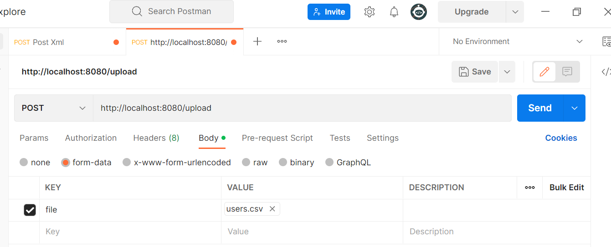

Assumptions:
- Input file must be ended .xml

Example:
- Input
users.xml
- Output
  [
  {
  "name": "Kalle Anka",
  "email": "donald@email.dt",
  "username": "donaldd"
  },
  {
  "name": "Joakim von Anka",
  "email": "scrooge@email.dt",
  "username": "onkelscrooge"
  },
  {
  "name": "Arne Anka",
  "email": "arne@email.com",
  "username": "arneanka"
  }
  ]

How to run:
To build executable file, please use
./gradlew shadowJar

To execute tests:
./gradlew test

Contact:
Sara - sara.przebinda@gmail.com
Project link: https://github.com/nessime7/XmlSpringParser
My GitHub: https://github.com/nessime7